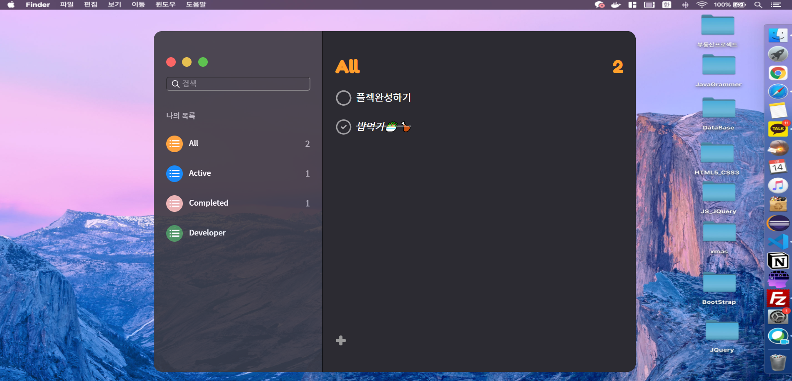

# 2020_01_15

## Todo-List

### *"오늘 할일" _ 해야 할 일, 완료한 일이 구분되어 있는 TodoList*

> HTML, CSS, JavaScript, Jquery 를 사용한 CRUD 구현 프로그램

- JSON_로컬 스토리지를 활용
- Web, Tablet, Mobile에 맞춰 반응형으로 구현
- null 값 입력을 제어 하기 위해 유효성 검사
- 수정하기 기능을 사용하게 될 때 기존 id 값을 유지
- 완료한 일을 다시 해야 할 일로 변경 시 저장소에도 반영될 수 있도록 구현
- 완료한 일에 class 추가하여 text- decoration 추가
- 목록 추가가 가능한 Active, All 에선 빈 공간을 클릭해도 input 생성

	

